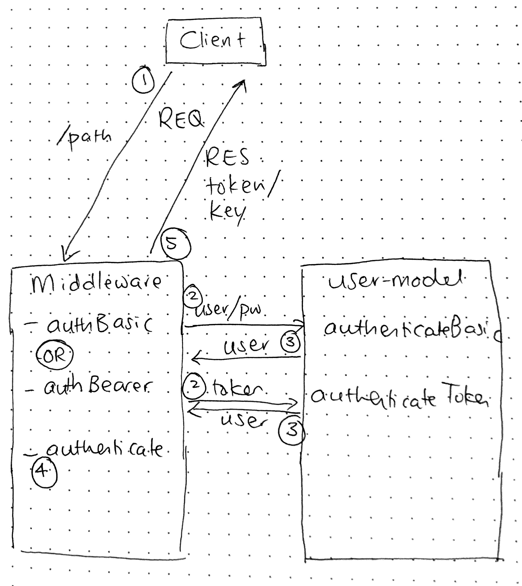

# LAB - 13

## Bearer Authentication

### Author: Joanna Arroyo

### Links and Resources
* [submission PR](https://github.com/joanna-401-advanced-javascript/lab-13-bearer-authentication/pull/3)
* [travis](https://travis-ci.com/joanna-401-advanced-javascript/lab-13-bearer-authentication)
* [front-end](https://lab-13-bearer.herokuapp.com/)

#### Documentation
* [jsdoc](https://lab-13-bearer.herokuapp.com/docs) (Server assignments)

### Modules
#### `app.js`
#### `router.js`
#### `middleware.js`
#### `users-model.js`
#### `404.js`
#### `error.js`

##### Exported Values and Methods

###### `_authBasic(authString) -> object`
Authenticates the request header if basic authentication
###### `_authBearer(authString) -> object`
Authenticates the request header if bearer authentication
###### `_authentication(user) -> object`
Generates user token 

### Setup
#### `.env` requirements
* `PORT` - 3000
* `MONGODB_URI` - mongodb://localhost:27017/db
* `SECRET` - encoding and decoding string
* `REMEMBER` - yes if want token to be used more than once for a set amount of time

#### Running the app
* `npm start`
* Endpoint: `/signup`
  * Returns a jwt token generated from the log in information.
* Endpoint: `/signin`
  * Returns a token for all future requests. Can be time sensitive or one-time use.
* Endpoint: `/key`
  * Returns a token for all future requests that will not expire.
  
#### Tests
* Unit test: `npm run test`
* Lint test: `npm run lint`

#### UML
